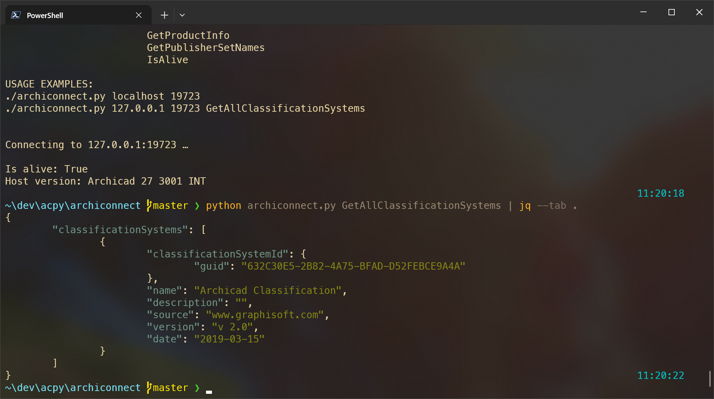

# Archicad Connect

## Info

Archicad Python and JSON API Connection Test [archiconnect]

- Version: `27.1.2.0`
- Created by GAG
- https://borsh.pro


## Overview

Connects to Archicad Python JSON API and shows Archicad host info.
Executes commands without parameters.

Tested with:

- Archicad 27 INT
- Archicad 26 INT

## Dependencies

### Required Dependencies

- Python 3.11+

macOS via [brew](http://brew.sh):

```sh
brew install python
```

Windows via [scoop](https://scoop.sh):

```sh
scoop install python
```

### Optional

- [jq](https://jqlang.github.io/jq/) to pretty print JSON data

macOS via [brew](http://brew.sh):

```sh
brew install jq
```

Windows via [scoop](https://scoop.sh):

```sh
scoop install jq
```

## Usage

```sh
./archiconnect.py ADDRESS PORT COMMAND
```

Where:

- ADDRESS
	- Network name or IP address of Archicad host.
	- Default address: 127.0.0.1

- PORT
	- Port of Archicad host.
	- Default ports range: 19723—19744

- COMMAND
	- Custom Archicad API command to execute.
	- Accepted commands without parameters:
		- GetActivePenTables
		- GetAllClassificationSystems
		- GetAllElements
		- GetAllPropertyNames
		- GetClassificationSystemIds
		- GetProductInfo
		- GetPublisherSetNames
		- IsAlive

## Usage examples

On macOS `./archiconnect.py` could be run directly from Terminal.


```sh
./archiconnect.py 127.0.0.1 19723 GetAllClassificationSystems
./archiconnect.py GetAllClassificationSystems
```

If you have `jq` installed, you can pipe the output to see pretty printed JSON data:

```sh
./archiconnect.py GetAllClassificationSystems | jq --tab .
```

## Sample output

```
Connecting to 127.0.0.1:19723 …

Is alive: True
Host version: Archicad 27 3001 INT
```

### Using on Windows in PowerShell

```sh
python archiconnect.py
python archiconnect.py GetAllClassificationSystems
```




## Archicad JSON Interface

Archicad offers local server with JSON Interface since Archicad 24.

- [Archicad JSON Interface Documentation](https://archicadapi.graphisoft.com/JSONInterfaceDocumentation/)
